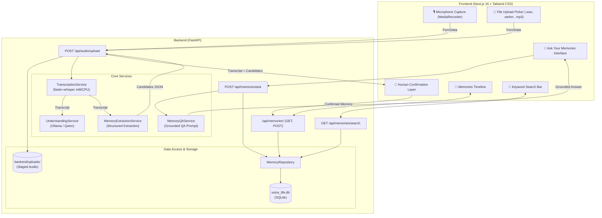

# 🏗️ Architecture & Technical Design

Voice → Life is built as a **local-first, modular personal memory intelligence layer**.

The architecture decouples the input source, transcription, cognitive understanding, memory extraction, persistence, and natural language retrieval.



---

## 🧩 Architectural Modules

### 1. Audio Ingestion & Preprocessing
- **Source Agnostic:** Accepts audio streams via browser `navigator.mediaDevices.getUserMedia` or file uploads (`.wav`, `.webm`, `.mp3`, `.m4a`, `.ogg`).
- **Safe Staging:** Incoming audio is temporarily assigned a UUID v4 name and saved to `backend/uploads/` (ignored by git).
- **FastAPI Endpoints:** Handled asynchronously via `python-multipart`.

### 2. Speech-to-Text (`faster-whisper`)
- **Engine:** `faster-whisper` based on CTranslate2 with `int8` quantization.
- **Model Size:** Defaults to `tiny` for immediate local verification (swappable to `base`, `small`, or `large-v3-turbo`).
- **Singleton Lifetime:** Initialized once during FastAPI lifespan startup to avoid per-request model loading overhead.
- **Audio Decoding Compatibility:** Patched wrapper to ensure compatibility with modern `av` (PyAV 19+).

### 3. Cognitive Understanding & Extraction (`Ollama`)
- **Engine:** Local inference via Ollama HTTP API with `format="json"` schema enforcement.
- **Model:** Open-weight `qwen2.5:0.5b` (or `qwen2.5:3b`, `gemma2:2b`, `llama3.2`).
- **Two-Phase Cognition:**
  1. **Understanding:** High-level summary and broad classification of intent.
  2. **Extraction:** Deterministic mapping into structured `Memory` objects (`type`, `text`, `person`, `place`, `date`, `time`, `confidence`).
  3. **Relative Date Resolution:** Today's ISO date is injected into the extraction context so relative temporal markers (e.g., *"kal"*, *"tomorrow"*, *"Monday"*) map to concrete ISO calendar days (`YYYY-MM-DD`).

### 4. Human-in-the-Loop Confirmation
- AI only generates **candidate memories**.
- Candidate cards are displayed in the UI with explicit **Confirm & Save** controls.
- The user decides what enters long-term memory.

### 5. Persistence (`SQLite`)
- Stored locally in `backend/voice_life.db` (zero external daemon required).
- Schema:
  ```sql
  CREATE TABLE IF NOT EXISTS memories (
      id INTEGER PRIMARY KEY AUTOINCREMENT,
      type TEXT NOT NULL,
      text TEXT NOT NULL,
      person TEXT,
      place TEXT,
      date TEXT,
      time TEXT,
      created_at TEXT NOT NULL
  );
  ```

### 6. Retrieval & Conversational QA
- **Timeline:** Sorted chronologically with automatic grouping by target event date.
- **Keyword Search:** Multi-column SQLite `LIKE` search spanning `text`, `type`, `person`, `place`, and dates.
- **Ask Your Memories:**
  1. User asks natural-language questions.
  2. Keyword extraction and search retrieves relevant memory records.
  3. Grounded QA prompt instructs the LLM to answer using **only** the provided context and strictly decline hallucination when information is absent.
